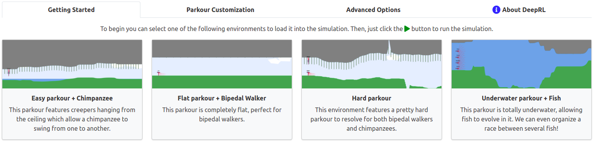
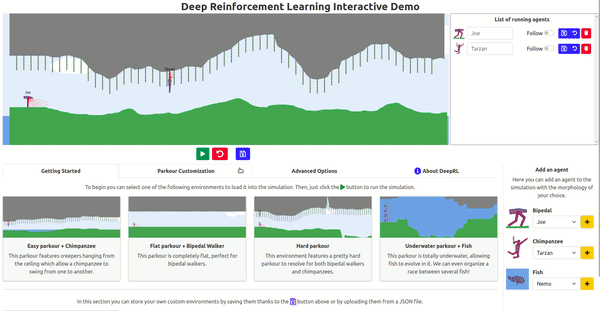

# Adding a new base environment

You can easily add a new environment to the base set which is displayed in the *Getting Started* tab in the demo.



**1. Save and download an environment**  
The first thing you need to do is to get a JSON file containing the data of the environment you want to add. To do that you, after customizing the environment at your convenience, you first need to save it to the custom set of environments and then to download it.



**2. Add the downloaded JSON file to the [`base_envs_set`] folder**

**3. [Optional] Set up for local launch**  
Generate the list of files in [`base_envs_set`]  
```
python3 list_base_envs.py
```

[`base_envs_set`]: ../web_demo/base_envs_set 